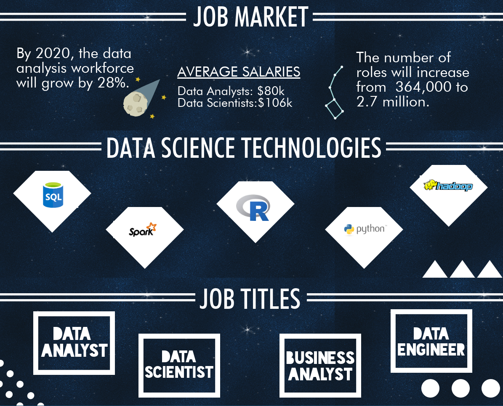

# FinalProject-DataScience-job-market

In this project, we used machine learning to explore the [Data Scientist Job Market in the US](https://www.kaggle.com/sl6149/data-scientist-job-market-in-the-us) dataset and try to predict salaries.
We will also use the [Indeed Dataset](https://www.kaggle.com/elroyggj/indeed-dataset-data-scientistanalystengineer#indeed_job_dataset.csv), as well as the [Data-Professional-Salary-Survey](https://data.world/finance/data-professional-salary-survey)
  
  We will use Machine learning models to predict the data profession salary with different features such as job type, location and industries etc. We will also compare the prediction results for different models to see how the models predict the same problem with different precisions.
 In this project, SQLite was used as the database. D3, Javascript, Leaflet or Plotly, and Tableau are used to realize the user friendly dashboard.

